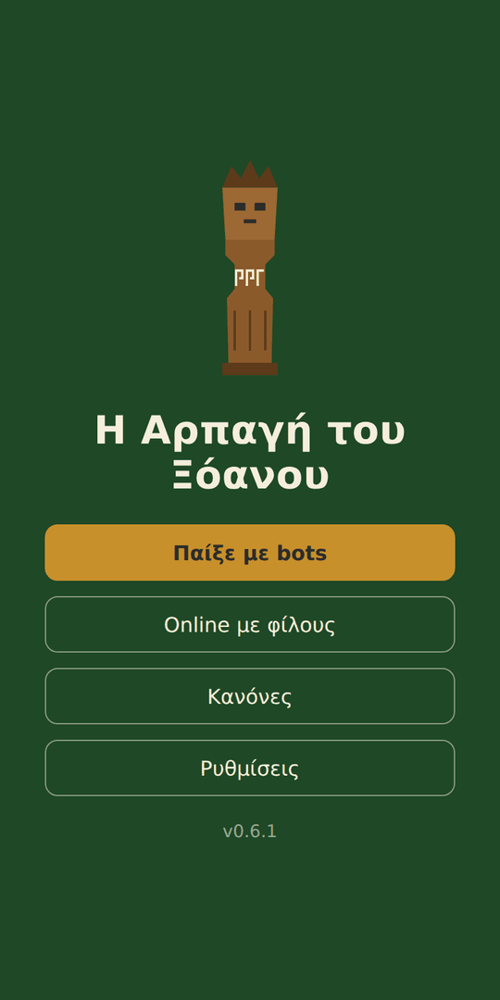
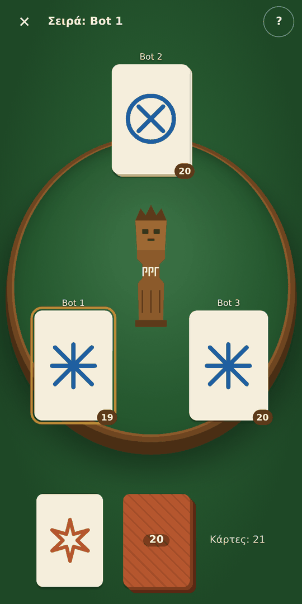
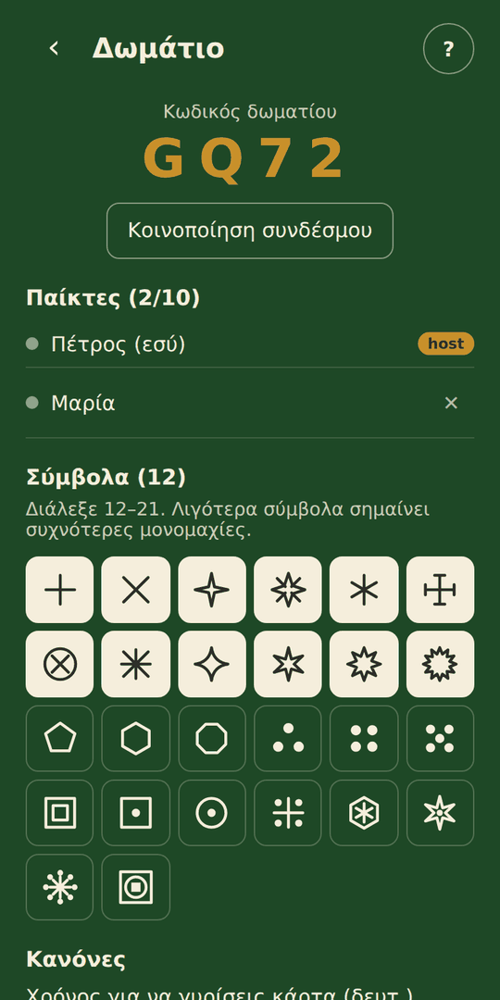
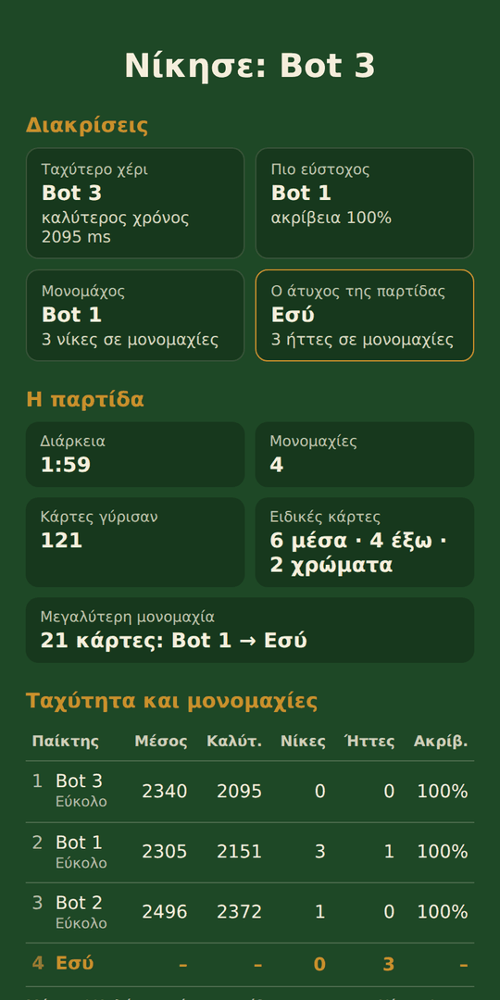
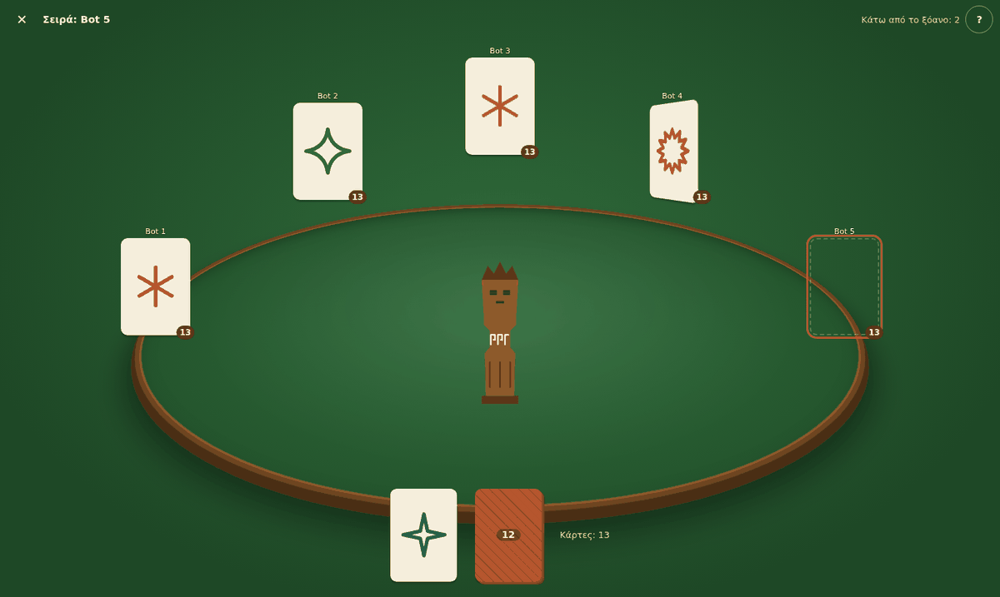
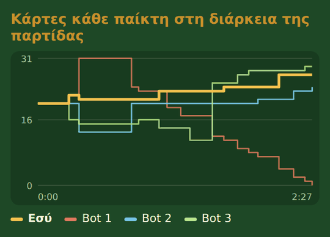

<h1 align="center">Η Αρπαγή του Ξόανου · The Theft of the Xoanon</h1>

<p align="center">
  <b>Παιχνίδι ταχύτητας για κινητά · A speed game for mobile</b><br>
  2–10 παίκτες online ή solo με bots · 2–10 players online or solo against bots
</p>

<p align="center">
  <a href="https://petrosfs.github.io/Arpagi-Xoanou-mobile/"><b>▶ Παίξε τώρα · Play now</b></a>
  &nbsp;·&nbsp;
  <a href="#ελληνικά">Ελληνικά</a> · <a href="#english">English</a>
</p>

<p align="center">
  <a href="https://github.com/petrosfs/Arpagi-Xoanou-mobile/actions/workflows/deploy.yml"></a>
</p>

<p align="center">
  
  
  
  
</p>

---

## Ελληνικά

### Τι είναι

Οι παίκτες γυρίζουν με τη σειρά κάρτες με σύμβολα. Όταν δύο ορατές κάρτες έχουν το **ίδιο σύμβολο**, οι
κάτοχοί τους παλεύουν να αρπάξουν πρώτοι το **ξόανο**, το ξύλινο είδωλο στο κέντρο του τραπεζιού. Ο χαμένος
παίρνει τις κάρτες· νικά όποιος ξεφορτωθεί πρώτος όλες τις κάρτες του. Τα σύμβολα μοιάζουν σκόπιμα μεταξύ τους,
και ειδικές κάρτες αλλάζουν τους κανόνες στη μέση του παιχνιδιού.

**[▶ Παίξε στο petrosfs.github.io/Arpagi-Xoanou-mobile](https://petrosfs.github.io/Arpagi-Xoanou-mobile/)**, από
κινητό ή υπολογιστή, χωρίς εγκατάσταση και χωρίς λογαριασμό.

### Χαρακτηριστικά

- **Solo** απέναντι σε 1–9 bots, σε 4 επίπεδα δυσκολίας.
- **Online με φίλους:** ο καθένας από το κινητό του, με κωδικό δωματίου ή σύνδεσμο πρόσκλησης.
- **Ρυθμίσεις παρτίδας:** 12–21 σύμβολα από κατάλογο 26 πρωτότυπων σχεδίων, χρόνος σειράς, κανόνες για
  πολλούς χαμένους, κανόνας 3 παικτών, τέλος με τον πρώτο νικητή ή πλήρης κατάταξη.
- **Σύνοψη στο τέλος:** διακρίσεις, διάρκεια και μονομαχίες, χρόνοι αντίδρασης, ακρίβεια, και γράφημα με τις
  κάρτες κάθε παίκτη στη διάρκεια της παρτίδας.
- **Ελληνικά και αγγλικά** (αυτόματα από τη γλώσσα της συσκευής), σελίδα κανόνων, σημάδια χρώματος για
  δυσχρωματοψία, σεβασμός της ρύθμισης «λιγότερες κινήσεις».

<p align="center"></p>

### Πώς είναι φτιαγμένο

| Κομμάτι | Επιλογή |
| --- | --- |
| Γλώσσα και build | TypeScript + Vite, **χωρίς UI framework**, για ελάχιστη καθυστέρηση στην απόκριση |
| Κανόνες | Καθαρή, ντετερμινιστική μηχανή (`src/engine`): ίδια κατάσταση και ίδια κίνηση δίνουν πάντα το ίδιο αποτέλεσμα |
| Online | Ένα κινητό είναι ο host· οι υπόλοιποι συνδέονται απευθείας μαζί του με **WebRTC** |
| Δωμάτια και παρουσία | **Firebase Realtime Database** με ανώνυμη σύνδεση και κανόνες ασφαλείας (`database.rules.json`) |
| Φιλοξενία | **GitHub Pages**, με αυτόματο test, build και deploy μέσω GitHub Actions· μηδενικό κόστος |

**Δίκαιο άρπαγμα.** Κάθε συσκευή μετράει τοπικά τον χρόνο αντίδρασης, από τη στιγμή που η κάρτα εμφανίστηκε
στη δική της οθόνη ως το άγγιγμα στο ξόανο. Έτσι η καθυστέρηση του δικτύου δεν αδικεί κανέναν. Σε ισοπαλία
(ως 30 ms) μετράνε τα δάχτυλα πάνω στο ξόανο και μετά πόσο κοντά στη βάση πιάστηκε, όπως στο πραγματικό τραπέζι.

**Online χωρίς server.** Ο host τρέχει τη μηχανή και στέλνει σε κάθε παίκτη μόνο ό,τι βλέπει, ποτέ τις κλειστές
κάρτες. Αν το WebRTC δεν ανοίξει (π.χ. σε κάποια δίκτυα κινητής), τα μηνύματα περνούν αυτόματα μέσω Firebase. Αν
φύγει ο host, αναλαμβάνει ο επόμενος παίκτης και η παρτίδα συνεχίζει από την αποθηκευμένη κατάσταση· όποιος
χάσει τη σύνδεση έχει 3 λεπτά να επιστρέψει.

**3D χωρίς κόστος.** Γύρισμα καρτών, τραπέζι με βάθος και κάρτες που πετούν στον χαμένο, μόνο με CSS
(`transform`/`opacity`). Οι κάρτες μένουν επίπεδες για άμεση αναγνώριση, και ο χρόνος αντίδρασης μετράει από τη
στιγμή που φαίνεται το σύμβολο.

**Ποιότητα.**
- **61 τεστ** (Vitest), με προσομοιώσεις χιλιάδων κινήσεων που ελέγχουν ότι δεν χάνεται ποτέ κάρτα και ότι κάθε
  παρτίδα τελειώνει.
- Κατά την ανάπτυξη, **δοκιμές σε πραγματικό browser** (Playwright): online παρτίδες με πολλούς παίκτες στο
  Firebase, αποσύνδεση και επανασύνδεση, αλλαγή host.
- Κατά την ανάπτυξη, **μετρήσεις απόδοσης** με επεξεργαστή 4× πιο αργό: το γύρισμα κάρτας εμφανίζεται σε
  ~20–30 ms (περίπου ένα καρέ) χωρίς κολλήματα.

<p align="center"></p>

### Δομή του κώδικα

```
src/
  engine/   κανόνες: τράπουλα, μονομαχίες, ειδικές κάρτες, κατάταξη
  game/     host, «εικόνα» του τραπεζιού για τους παίκτες, στατιστικά
  solo/     bots και ρυθμός τους
  net/      Firebase, δωμάτια, WebRTC με εναλλακτική αναμετάδοση
  screens/  οθόνες: αρχική, ρυθμίσεις, lobby, παρτίδα, σύνοψη, κανόνες
  ui/       σύμβολα, κάρτες, ξόανο, διάταξη τραπεζιού, κινήσεις
  i18n.ts   ελληνικά και αγγλικά
```

### Τοπική εκτέλεση

```bash
npm install
npm run dev     # τοπικός server
npm test        # τεστ
npm run build   # build στον φάκελο dist
```

Για δικό σου online: φτιάξε project στο Firebase με **Anonymous Authentication** και **Realtime Database**,
επικόλλησε τους κανόνες από το `database.rules.json` και βάλε τα στοιχεία της web εφαρμογής στο
`src/net/config.ts`.

---

## English

### What it is

Players take turns flipping cards with symbols. When two visible cards show the **same symbol**, their owners
race to grab the **xoanon**, the wooden idol in the middle of the table. The loser takes the cards; the first
player to get rid of all their cards wins. The symbols are deliberately similar, and special cards change the
rules mid-game.

**[▶ Play at petrosfs.github.io/Arpagi-Xoanou-mobile](https://petrosfs.github.io/Arpagi-Xoanou-mobile/)**, on a
phone or a computer, with no install and no account.

### Features

- **Solo** against 1–9 bots at 4 difficulty levels.
- **Online with friends:** everyone on their own phone, via a room code or an invite link.
- **Game settings:** 12–21 symbols from a catalogue of 26 original designs, turn timer, rules for several
  losers, 3-player rule, end with the first winner or a full ranking.
- **End-of-game summary:** awards, duration and duels, reaction times, accuracy, and a chart of each player's
  cards over the game.
- **Greek and English** (automatic from the device language), rules page, colour marks for colour blindness,
  respects the “reduce motion” setting.

### How it is built

| Part | Choice |
| --- | --- |
| Language and build | TypeScript + Vite, **no UI framework**, for minimal input latency |
| Rules | A pure, deterministic engine (`src/engine`): the same state and move always give the same result |
| Online | One phone is the host; the others connect to it directly over **WebRTC** |
| Rooms and presence | **Firebase Realtime Database** with anonymous sign-in and security rules (`database.rules.json`) |
| Hosting | **GitHub Pages**, with automatic test, build and deploy via GitHub Actions; zero cost |

**Fair grabbing.** Each device measures reaction time locally, from the moment the card appeared on *its own*
screen to the touch on the xoanon, so network latency does not penalise anyone. On a tie (within 30 ms), the
number of fingers on the xoanon counts, then how close to the base it was held, just like at a real table.

**Online without a server.** The host runs the engine and sends each player only what they can see, never the
face-down cards. If WebRTC cannot connect (e.g. on some mobile networks), messages automatically go through
Firebase. If the host leaves, the next player takes over and the game resumes from the saved state; anyone who
loses connection has 3 minutes to come back.

**3D at no cost.** Card flips, a table with depth and cards flying to the loser, using CSS only
(`transform`/`opacity`). Cards stay flat for instant recognition, and reaction time counts from the moment the
symbol is visible.

**Quality.**
- **61 tests** (Vitest), including simulations of thousands of moves that check no card is ever lost and every
  game ends.
- During development, **real-browser tests** (Playwright): online games with several players on Firebase,
  disconnect and reconnect, host migration.
- During development, **performance checks** on a 4× slower CPU: a flipped card appears within ~20–30 ms
  (about one frame) with no dropped frames.

### Code layout

```
src/
  engine/   rules: deck, duels, special cards, ranking
  game/     host, per-player table view, statistics
  solo/     bots and their pacing
  net/      Firebase, rooms, WebRTC with relay fallback
  screens/  screens: home, settings, lobby, game, summary, rules
  ui/       symbols, cards, xoanon, table layout, gestures
  i18n.ts   Greek and English
```

### Running locally

```bash
npm install
npm run dev     # local server
npm test        # tests
npm run build   # build into dist
```

For your own online setup: create a Firebase project with **Anonymous Authentication** and **Realtime
Database**, paste the rules from `database.rules.json`, and put your web app config in `src/net/config.ts`.

---

© Όλα τα δικαιώματα διατηρούνται · All rights reserved.
